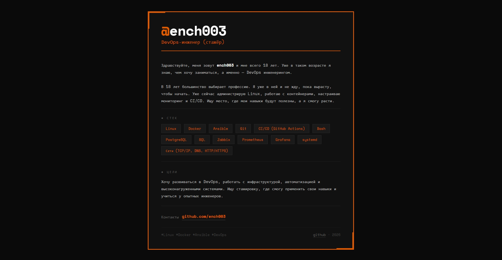
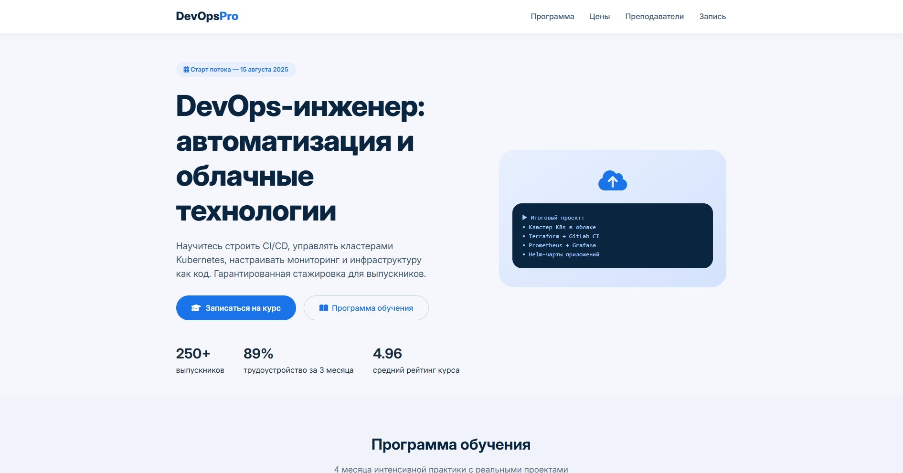

# Мои проекты

---

## docker/project_1

В проекте поднимаются 4 контейнера:
- веб-сервер (nginx) — два сайта на разных портах
- база данных (postgres)
- админка для базы (adminer)
- сбор метрик nginx для Prometheus (nginx-exporter)

Запуск:
``` bash
cd projects/docker/project_1
docker compose up -d
```
Доступ:
- Первый сайт: `http://<айпишник VPS или localhost>:8081`
- Второй сайт: `http://<айпишник VPS или localhost>:8082`
- Adminer: `http://<айпишник VPS или localhost>:8083`
- Метрики nginx-exporter: `http://<ip VPS или localhost>:9113`
- Сервер БД: `db`
- Пользователь БД: `ench003`
- База данных: `user_db`
- Пароль: `задаётся в docker-compose.yml в POSTGRES_PASSWORD`

При входе в контейнер выводится welcome-скрипт с информацией о системе

### Скриншоты
| Первый сайт | Второй сайт |
|--------|--------|
|  |  |

---

## sysinfo-project

Скрипт собирает информацию о системе:
- сколько места на диске
- сколько свободной памяти
- как долго работает сервер

Запуск:
``` bash
cd projects/sysinfo-project
./system-info.sh
```
Результат записывается в файл `sysinfo.log` в папке со скриптом

---

## Log_Watcher
Скрипт каждую минуту проверяет доступность сайта
- Если скрипт запущен на локалке: `http://localhost:8080`
- Если скрипт запущен на VPS: `http://<IP_VPS>:8080`, но перед этим в файле `log_watcher.sh` нужно изменить url

Запуск:
``` bash
cd projects/Log_Watcher
./log_watcher.sh
```
Скрипт работает вручную, для остановки нажать `Ctrl+C`  
Результат записывается в файл logs.log в папке со скриптом

Так же в скрипте можно убрать while и запускать его через cron, чтобы он не работал на постоянке, а запускался каждую минуту и писал в логи отчет

---

## ansible_project

Плейбук для деплоя всего проекта на чистом VPS.

Запуск:
``` bash
cd projects/ansible_project
# Вставить данные в inventory.ini без <>
ansible-playbook -i inventory.ini deploy.yml
```
Что делает:
- устанавливает `Git, Docker и Docker Compose`
- клонирует репозиторий в `~/projects`
- выполняет `docker compose up -d`

---

## CI/CD (GitHub Actions)
Авто деплой на VPS при пуше в ветку main.
Файл: `.github/workflows/deploy.yml`

Что делает:
- добавляет возможность запустить пайплайн вручную во вкладке Actions 
- проверяет `docker-compose.yml`
- запускает тестовые контейнеры и проверяет доступность сайта
- подключается по SSH к VPS
- обновляет код
- пересобирает и перезапускает контейнеры
- чистит старые образы

Секреты GitHub (Settings - Secrets and variables - Actions):
- VPS_HOST - IP сервера
- VPS_USER - имя пользователя
- VPS_SSH_KEY - приватный SSH-ключ

---

## Контакты

GitHub: ench003
